[← Back to homepage](/)

Secure Shell Host is a protocol that secures communications with another system over an unsecured network by encrypting all data that is sent to prevent any sensitive data from being intercepted. Understanding how SSH authentication, key management, tunnelling, and file transfer work is important in understanding the vulnerabilities that Nmap identifies.

## Section 1: SSH Connection Basics

1: Connect to a remote server using ssh

This is used to remotely control a remote server from your local machine using the remote servers ip address and logs in as a user that is already registered on the host machine. The output shows a successful login and information about the remote server. In the terminal the name of the user has changed from kali@kali to student@wordpress.

Figure 118 - ssh output

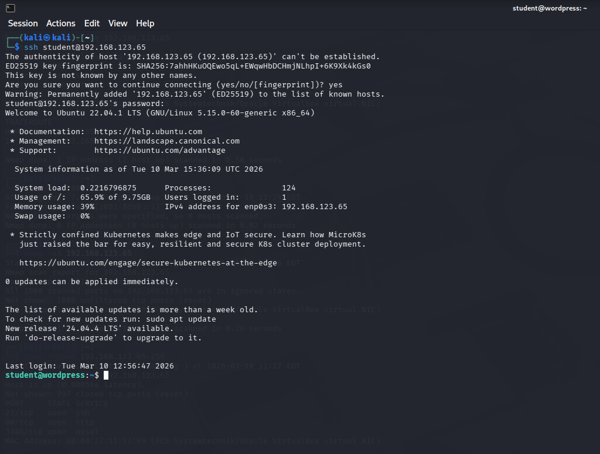

Specify A port:

Figure 119 - Output for port 22

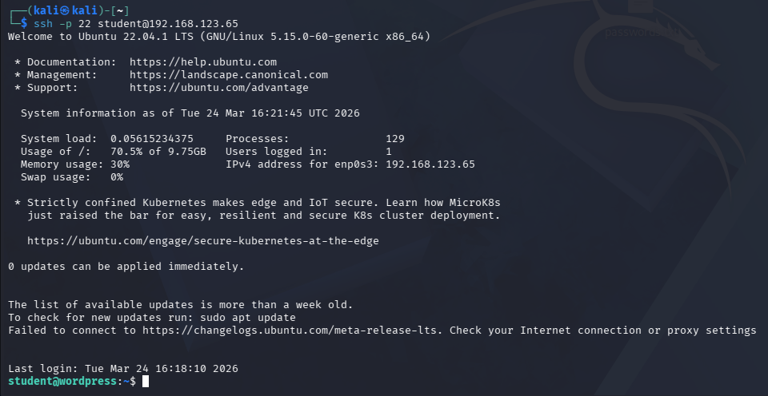

## Section 2: SSH Authentication and Key Management

Generate a 4096-bit RSA SSH key pair

Enables logging in without a password which supports stronger access control but if the private key is stolen then the security benefits are reduced. To mitigate this weakness, protect the private key with a passphrase and keep it safe. The output shows SHA256 encrypted key has been created and saved [24].

Figure 120 - Output of key Generation

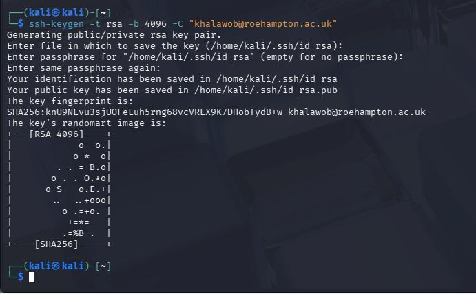

Copy public key to remote server

Used to login without password on the remote machine, reducing the risk of brute force as long as password authentication is disabled [25]. Output shows the key was successfully copied.

Figure 121 - Copy Key to remote server

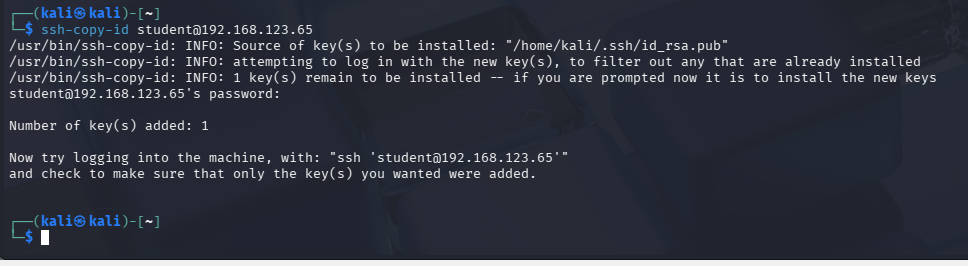

Successful Passwordless Login

Figure 122 - No Password Login

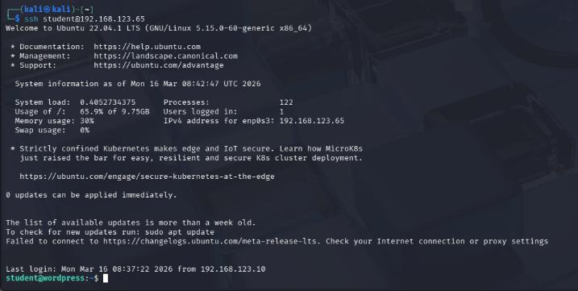

## Section 3: Managing SSH SESSIONS

Log out using the “exit” command

Output shows the username has reverted to kali@kali

Figure 123 - Log out output

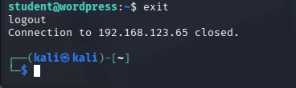

Remote commands

Used to log into the remote server using ssh and execute “ls -la” to list files in the student users directory.

Figure 124 - Ls-la SSH Output

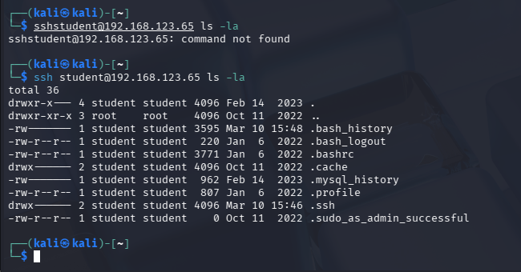

## Section 4: File Transfer With SCP

Copy a File from Local to Remote

Uses Secure Copy Protocol to copy files.txt from the local machine to the specified remote directory using ssh to ensure transferred data is encrypted. This is useful for collecting sensitive files safely but it does not protect against malware. The output shows the file has been located and transferred to the remote directory [26].

Figure 125 - SCP Output

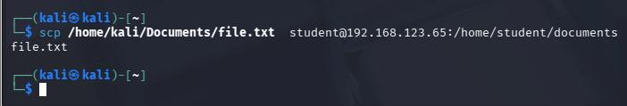

Copied file.txt to the remote directory

Figure 120 - SCP upload of file.txt to the remote Documents directory

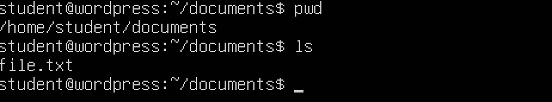

Copy from remote to local

Figure 121 - SCP command to copy a file from the remote server to the local machine

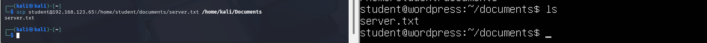

Output showing the file has been copied to kali

Figure 122 - Local Documents folder showing the file copied from the remote server

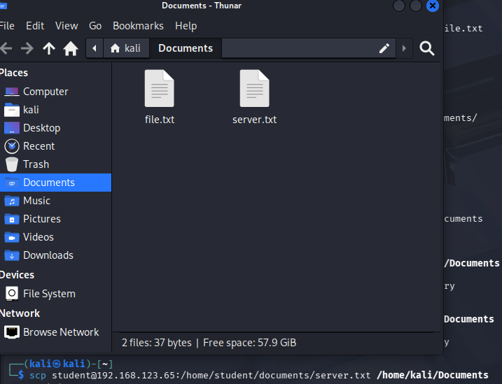

## Section 5: Secure File Transfers with SFTP

Connect to a Remote Server using SFTP

SSH file transfer protocol is an alternative to SCP where you can do CRUD operations directly from the terminal and is reliable alternative to SCP if the connection is unstable. The output shows we have successfully connected to the remote server using SFTP

Figure 123 - SFTP connection established to the remote Ubuntu WordPress server

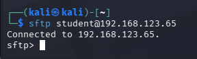

SFTP LS

Lists the file on the remote machine

Figure 124 - SFTP ls output listing the documents directory on the remote server

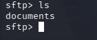

Download a File from the Remote Ubuntu Wordpress server with SFTP

Using the get command along with the working remote directory path of the file we want to download

Figure 125 - SFTP get command downloading file.txt from the remote server

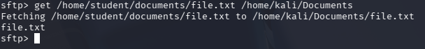

Output of the file we copied from the remote server to kali

Figure 126 - Downloaded file shown in the local Documents folder

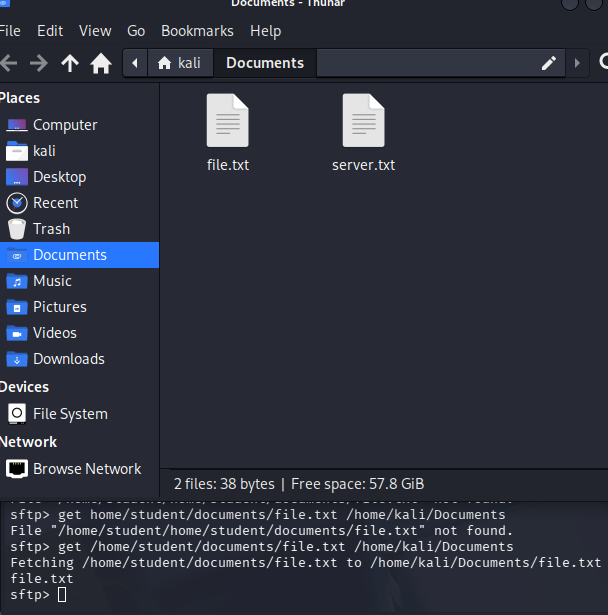

### Comparison between STFP and SCP

| SFTP | SCP |
| --- | --- |
| Best used if connection is unstable | Best used with a stable connection |
| Do commands inside the terminal | Do commands outside the terminal. |
| Used to manage Files remotely | Used to copy files from one host to another. |

## Section 6: Tunneling with SSH

Local Port Forwarding on Port 8080 to Remote Host Port 80 using the -L flag

Used for securing port forwarding methods by tunnelling TCP/IP packets through a SSH link to make the data obscure and protecting the link from attacks.

Figure 127 - Local port forwarding from local port 8080 to remote host port 80

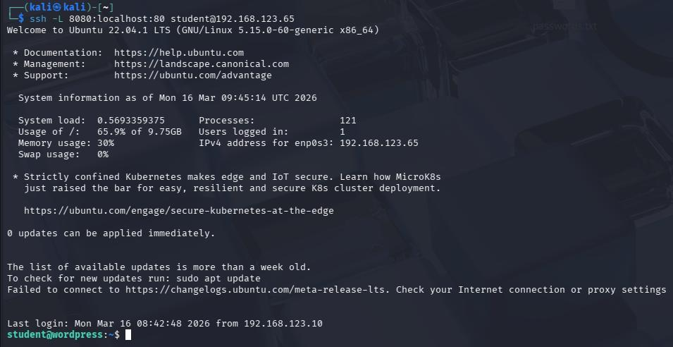

Remote Port Forwading using the -R flag

Requests on remote server port 9090 should be forwarded to local host at port 80. a request is made to the server on port 9090 a reply from local host would be recieved.

Figure 128 - Remote port forwarding from remote port 9090 to local host port 80

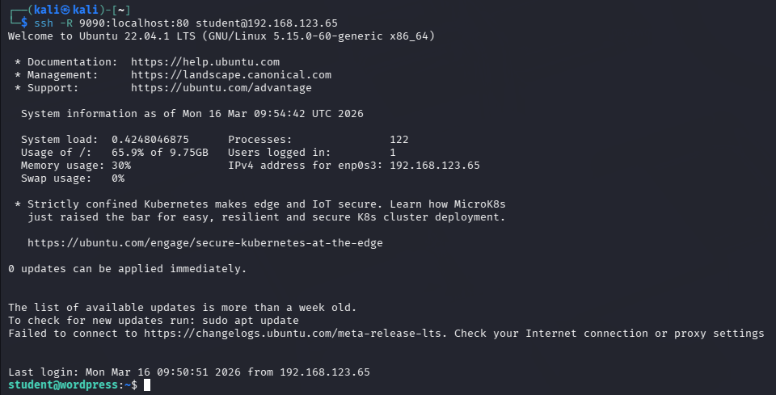

## Section 7: MultiPlexing and Persistent Connections

MultiPlexing and Persistent connections

(This command creates a persistent connection 60 seconds after the session ends)

Figure 129 - SSH multiplexing command using persistent connection options

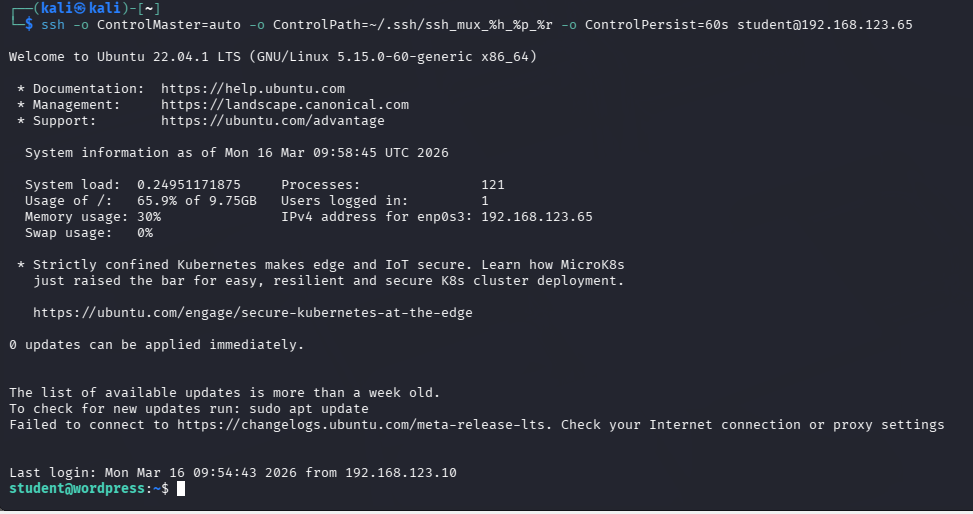

Logout Output:

Figure 130 - Output of the multiplexed persistent SSH connection (Difference is that there is a “shared connection”

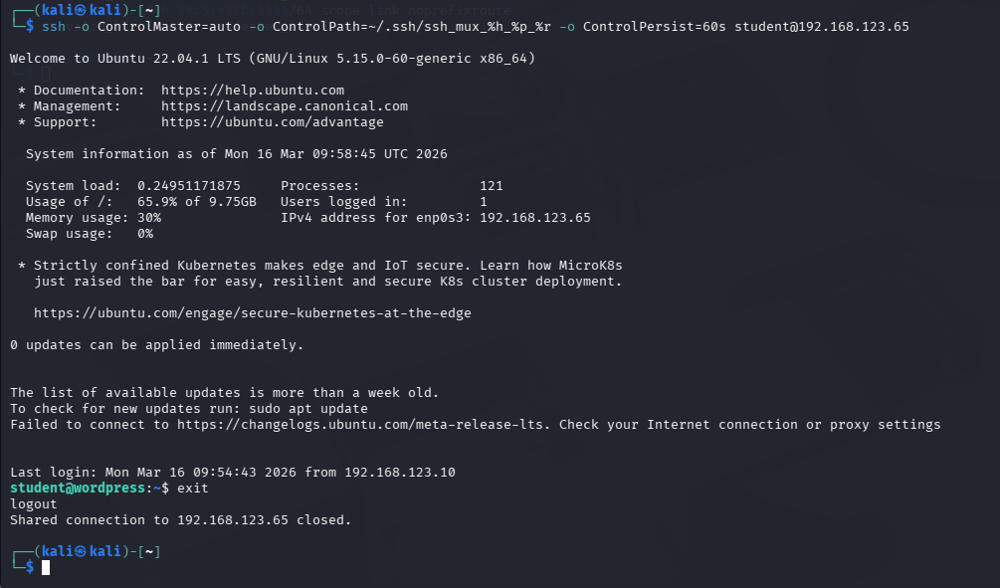

## Section 8: Advanced SSH Options

Logging in with a different key

Connects using a specified private key file instead of the default key

Figure 131 - SSH login using a specified private key file

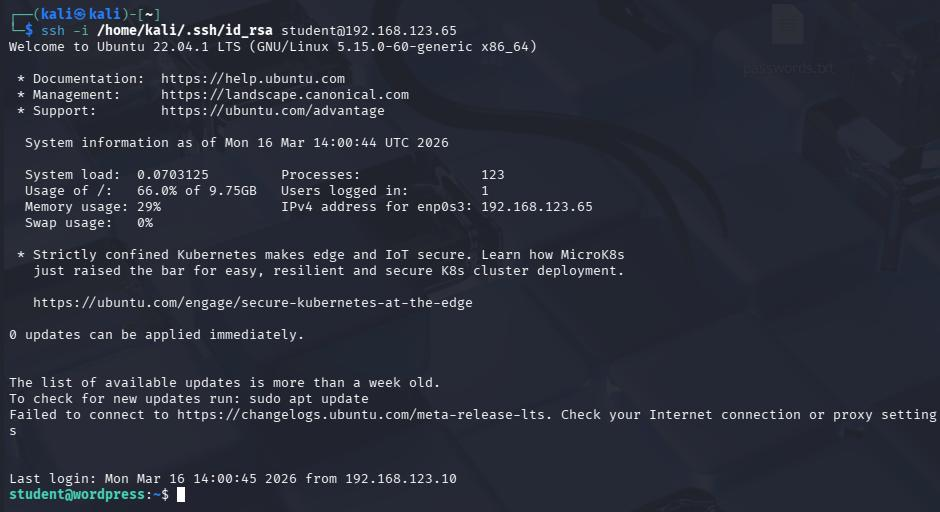

SSH Debug (Verbose Mode)

Enables verbose mode and verbose output which can be used for diagnosing issues

Figure 132 - Verbose SSH session output used for debugging

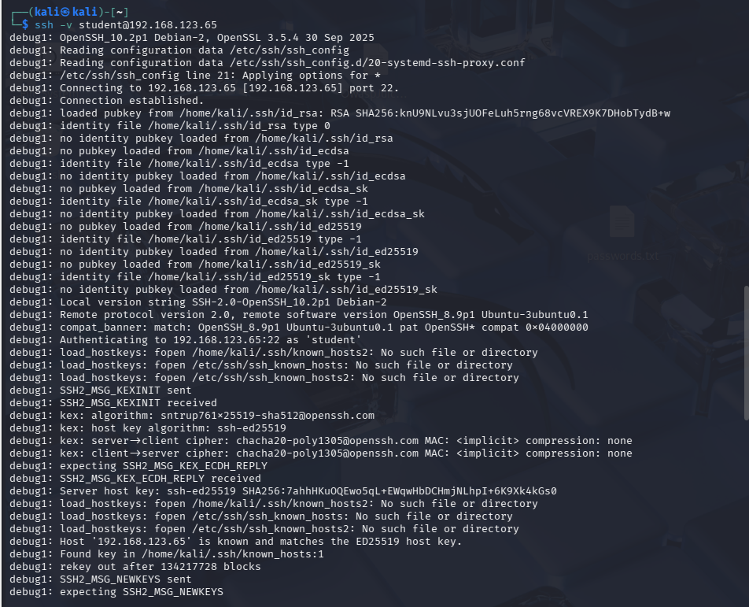

Figure 133 - Additional verbose SSH debug output during the session

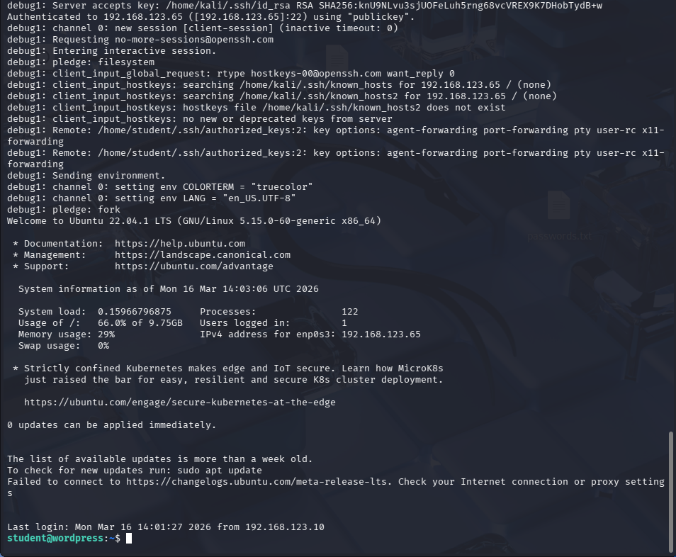

Logging out in verbose mode (Prints out how many bytes were used and exit status before closing the connection)

Figure 134 - Verbose logout output showing bytes transferred and exit status

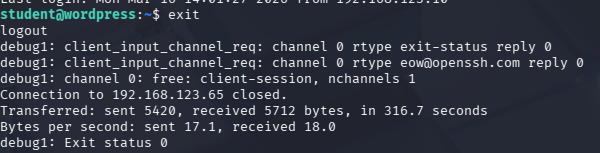

### Difference between Verbose Mode and Normal Mode

| Normal SSH Mode | Verbose Mode |
| --- | --- |
| Only prints out the results of the connection attempt. | Prints debugging information such as port number used, file path of the pubkey. |
| Only prints “logout” when logging out. | Prints how many bytes were used every second and the exit status when logging out. |
| Used for logging in. | Used for Identifying bugs in SSH Configuration. |

Limiting Bandwith speed with SCP

This limits how much bandwith the file transfer uses which reduce the chance of affecting the performance of a shared network [26].

Figure 135 - SCP bandwidth limiting command output

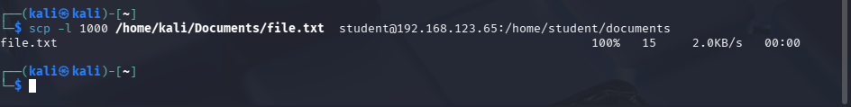

Lab 3 Reflection

Lab 3 has taught how Nmap is used to identify live machines, scanning ports, detecting the OS a machine is using and creating custom scripts to detect vulnerabilities or check performance. Using every scan type has revealed that no scan is perfect, but each scan is built for a specific purpose as each scan involves a trade-off between coverage, speed, stealth and the required access level like the Syn scan which is slower and stealthier than the TCP scan, but the downside is that it requires root access. The NSE Vulnerability script revealed that NMAP could be converted from a reconnaissance tool, into a vulnerability scanner that returned findings including exposed WordPress paths, potential CSRF Vulnerabilities and username Enumeration which complement the WPscan exercise very well.

The SSH part of the lab has taught how SSH operates beyond remotely logging into a machine. Key based authentication showed the weaknesses of password logins because once the RSA key pair was copied to the WordPress server, passwordless login was successful without transmitting passwords. The file transfer comparison between SCP and SFTP revealed that there one is not better than the other, If users need to quickly copy files, then SCP is good but if the connection is unstable or need to remotely manage files that don’t just include copying then SFTP is the better alternative. Verbose mode proved itself to be good for debugging failed connections by showing which key files are checked and which cipher algorithms were used.

## Strengths and Weaknesses

Nmap NSE Scripting capabilities makes it highly adaptable as this port scanner can run targeted checks for CVE’s, enumerate http directories or test database configurations. The range of output formats makes it suitable for both manual review and automatic pipeline integration. Nmap becomes unreliable when firewalls are active on the target machine due to ports becoming filtered and being unable to detect the Operating System. This suggests that Nmap’s effectiveness depends on the network environment and should not be treated as the ultimate tool in securely configured networks.

SSH encrypts all transmitted data making it securer than alternatives who use plaintext to transmit data. Key based authentication removes the risk of brute forcing password when setup correctly however a major risk is that if password authentication is not disabled after setting up key-based login, then the server remains vulnerable to brute force attacks. Additionally, SSH tunnelling, while useful for legitimate purposes, can be exploited by attackers to bypass firewalls and steal data through an encrypted channel that may not be inspected by network monitoring tools. The lab also showed that bandwidth must be actively limited using the -l flag with SCP, since by default SCP will consume as much bandwidth as available, which could cause disruption on shared networks.

---

[← Back to homepage](/)
