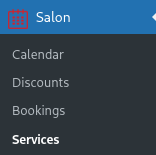
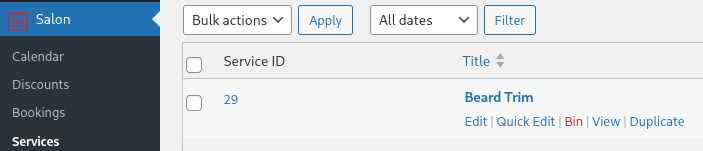
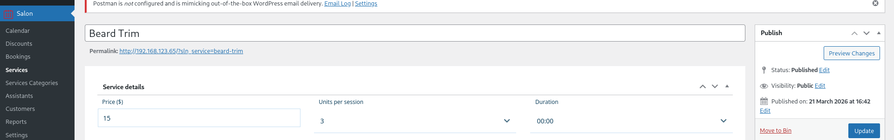
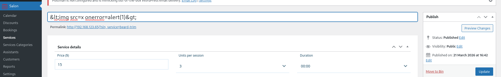
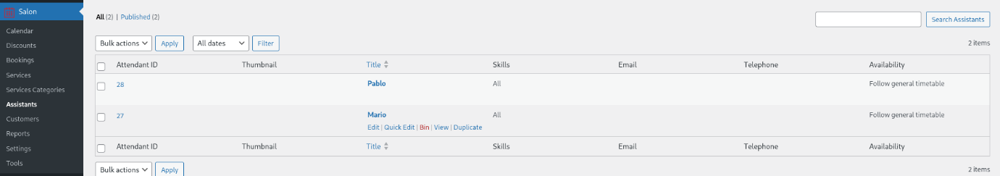
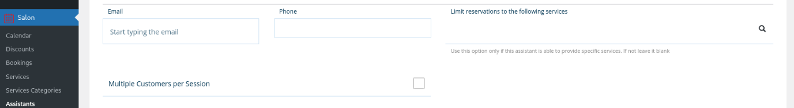
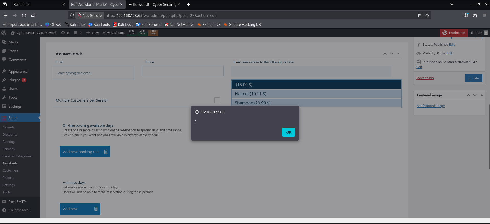
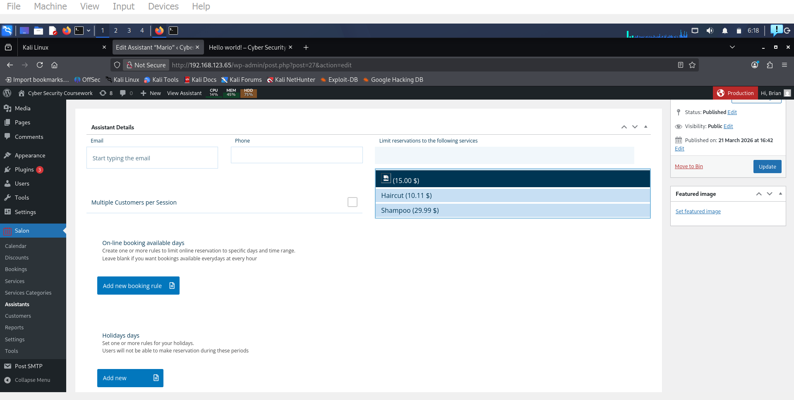

# Week 5 Further Learning: (EXPLOTING VULNERABILITIES)

This section will show one of the exploits found using Wpscan be exploited to show the dangers of not implementing solutions provided by WPscan. This section will cover a XSS attack being executed on the Salon booking plugin installed on the WordPress site [2]. The reason why this vulnerability exists is because the plugin does not check or clean the input and settings, which could allow high privilege users such as admin to perform Stored Cross-Site Scripting attacks [2] [3].

Figure 23 - Vulnerability Description [3]

![Figure 23 - Vulnerability Description [3]](week5-further-learning-exploting-vulnerabilities/001_Figure_18_-_Vulnerability_Description_3.png)

Step 1: Go to the services page of the salon plugin

Figure 24 - Services Section Of the Plugin

Step 2: go to the “Title” field

Figure 25 - Title Field

Step 3: Change the title from beard trim to &lt;img src=x onerror=alert(1)&gt;

Figure 26- Beard Trim is the Title

Title has been changed to &lt;img src=x onerror=alert(1)&gt;

Figure 27 - Title Changed to Code

Step 4 go to the assistant’s page and select one of the assistants to edit

Figure 28- Assistant section showing 2 Assistants

Click on limit reservations to the following services

Figure 29 - Limiting Reservations for Mario

Output of the XSS Attack:

The data has entered the web application through an untrusted source through a web request, and the data has been included in dynamic content (The box) and is sent to a web user without being checked for harmful content

Figure 30 - Output of the XSS Attack

Figure 31 - Image Icon

Stored XSS Exploit (Salon Booking Plugin) CIA Triad Impact

| Confidentiality – At risk | Integrity – Breached | Avaliability – Indirect Risk |
| --- | --- | --- |
| stored XSS payload’s could steal session cookies from anyone who visits the website, including other administrators which can lead to account takeover without needing credentials | An authenticated administrator can install malicious plugins, modify page content, or alter site settings and compromise the trustworthiness of all data | An attacker with administrator access could deactivate all plugins, delete posts, pages or corrupt the database |

Reflection

This lab has taught me where WordPress vulnerabilities are discovered in the form of plugins and vulnerabilities and how to target them using WPscan such as “vp” for vulnerable plugins and “vt” for vulnerable themes. I have also been reminded of the importance of updating plugins since when I downloaded the latest version of any plugins or themes, there were no vulnerabilities. When using older versions however, many exploits were found and because many websites use WordPress, these vulnerabilities could be exploited to not only harm businesses but customers. The scanning method and what you scan is also important because if you scan all plugins then you trade much more time in return for more results. If you scan vulnerable plugins only, then you reduce that time in exchange for not scanning everything. I have also learnt the importance of using the API key when scanning because it provides access to WPscan’s database of vulnerabilities and will give vulnerabilities of what you are using.

Strengths and Weaknesses

The strengths of WPscan is that the API Key provides real time vulnerability data instead of relying on outdated local signatures. The output of vulnerabilities provide CVE References and version patches which map directly to actions to patch these exploits.  The limitations are that WPscan only works with WordPress. Because it uses a database, it is not good for locating zero-day exploits and the API can only be used 25 times a day. Brute forcing can take time if the password is strong.
