[← Back to homepage](/)

Nmap is a industry-standard tool used by penetration testers to understand what services are running and on which ports before exploiting any vulnerabilities [6]. Nmap combines host discovery, port scanning, service version detection, operating system fingerprinting, and scriptable vulnerability checking within a single tool

## Section 1: Basic Host Discovery

Nmap Ping scan

Establishes if a system is reachable which is important because actual targets need to be found before anything else is done. A downside is that it might avoid systems with enabled firewalls block ping probes. Based on this information, a mitigation strategy could be enabling the firewall on the device and configure it to block host discovery [13] [14].

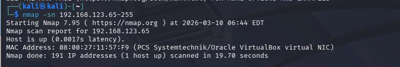

*Figure 88- Output of the ping Scan*

Single Host Scan

Establishes if the system is reachable and displays open ports which reveal potential areas to attack. A downside is that service version and software version are not identified. To protect against this it would be best to close unused ports [14].

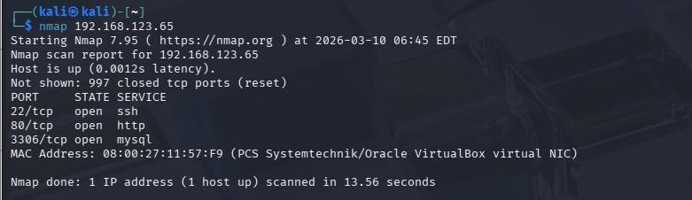

*Figure 89 -Single Host Scan Output*

Multi host scan

Reveals if multiple systems are reachable at once and also displays open ports for each system that is identified. A limitation is that scanning multiple hosts can still miss unresponsive systems [14].

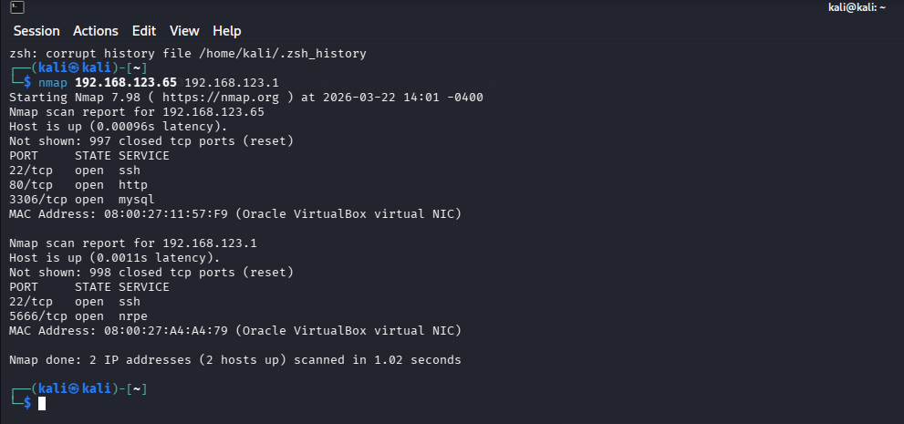

*Figure 90 - Output of multi Host scan*

Subnet Scan

Establishes if the system is reachable and also displays open ports. This is useful for discovering devices in a network. A downside is that it does not show if discovered services are vulnerable [13].

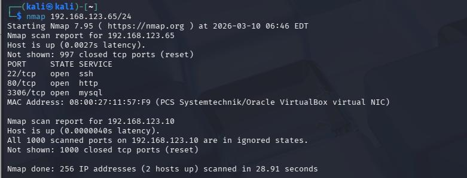

*Figure 91 - Output of Subnet Scan*

The output for most scans shows if the host is reachable, the amount of closed ports, name of open ports and the mac address which is important because it means that a potential target has been found and could be exploited but it does not say anything about the operating system or the software version they are using so another type of scan has  to get this information. Below is a table containing the differences between each scan.

## Scan Comparison and Analysis

| Ping Scan | Single Host | Multi Host | Subnet |
| --- | --- | --- | --- |
| Used to check if host is up | Used for scanning 1 host at a time | Good for scanning multiple Hosts at once | Must add the subnet at the end of the IP address |
| No port scan | Scans ports | Scans ports | Scans ports |

## Section 2: Port Scanning

TCP Connect scan

Completes full handshakes to check open ports which is useful for identifying reachable services but is more likely to appear in logs making it less stealthy so its important to check logs for this scan [15].

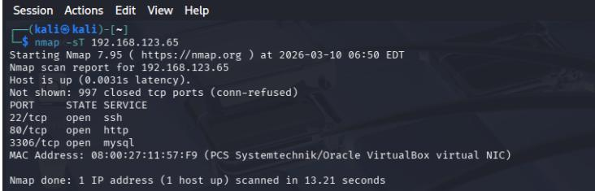

*Figure 92 - Output of TCP Connect Scan*

SYN scan

Tests ports without fully completing the handshake which makes it stealthier than TCP but firewalls or filtering can affect the results. To mitigate this, it would be best to close unused ports [15].

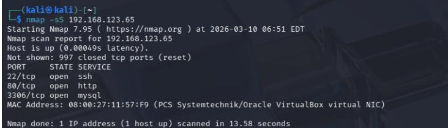

*Figure 93 - SYN Scan*

Port Range SCAN

This is used to find open ports more quickly by scanning multiple ports at once but a limitation is that short ranges can miss services outside of the range. To mitigate the effects of this scan, users should check if any service in the range is necessarily exposed [16].

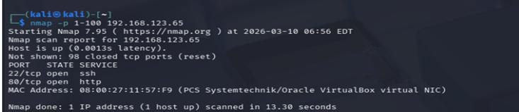

*Figure 94 - Output of Port Range Scan*

Scan Specific ports

Checks specific ports to see if selected services are reachable which is useful for checking if services like SSH are being used [16].

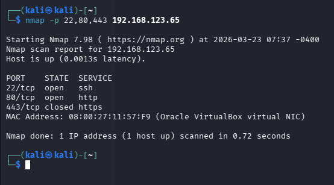

*Figure 95 - Scan Specific Ports*

## Comparison Table

| TCP Connect Scan | SYN Scan | UDP Scan | Port range scan | Scan Specific Ports |
| --- | --- | --- | --- | --- |
| sT | sS | sU | P | P- |
| Faster than SYN but more detectable | Slower Than TCP but more stealthy | Used for discovering  UDP Ports | Used to define a range of ports to scan | Used to scan specific ports |

## Section 3: Software Version detection

This shows the version of software being used next to the “SERVICE Column. This is one of the most useful scans for attackers because it helps attackers determine the software version and they can then research any known vulnerabilities found in the software version and exploit. It also gives clues about the type of operating system being used but it does not show the version being used so attackers will need to use another scan to get that information.

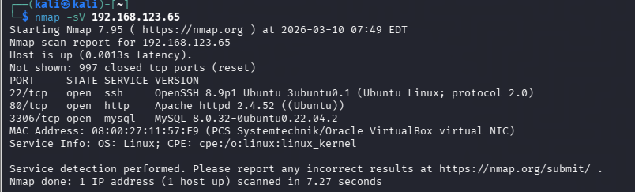

*Figure 96-Software Version Detection Output*

## Section 4: Operating system detection

This shows the version of the operating system being used near the bottom of the screen. It helps attackers find out the operating system being used by the target and the version of the operating system and they can research vulnerabilities and choose find the appropriate ones to exploit. This scan does not show the version of the software being used but that information can be found with “-Sv” which combined with Operating System detection makes finding vulnerabilities and exploiting devices easier.

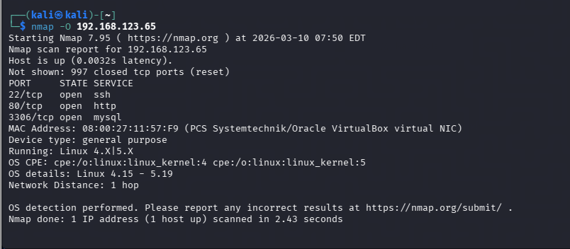

*Figure 97- OS Detection Output*

## Section 5: Aggressive Scan

Used for detecting Operating system, the version used, script scanning and traceroute. While it provides better information than the regular scans, it sends out more probes and is more likely to be detected during a security audit [14].

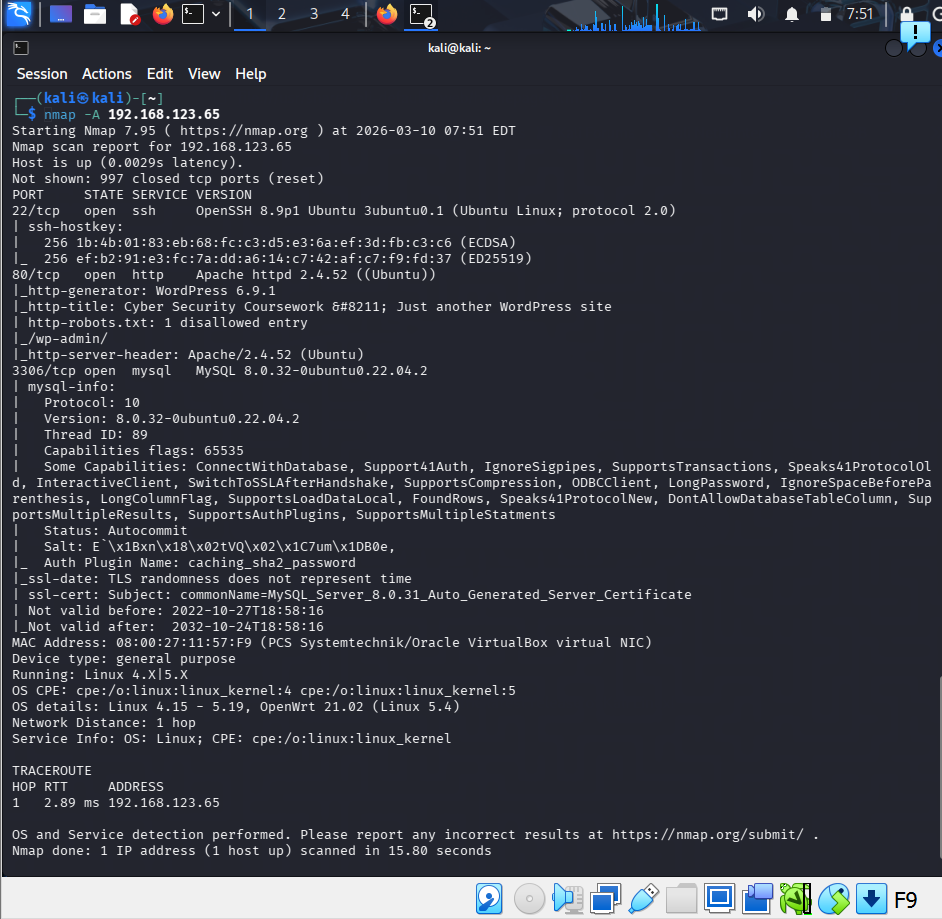

*Figure 98 - Aggressive Scan*

## Section 6: NMAP Scripting Engine (NSE

1: Vulnerability Script

Used to check for weaknesses in a systems configuration by highlighting possible attack paths but the results still need validation due to the possibility of scripts producing incomplete findings or false positives [19]:

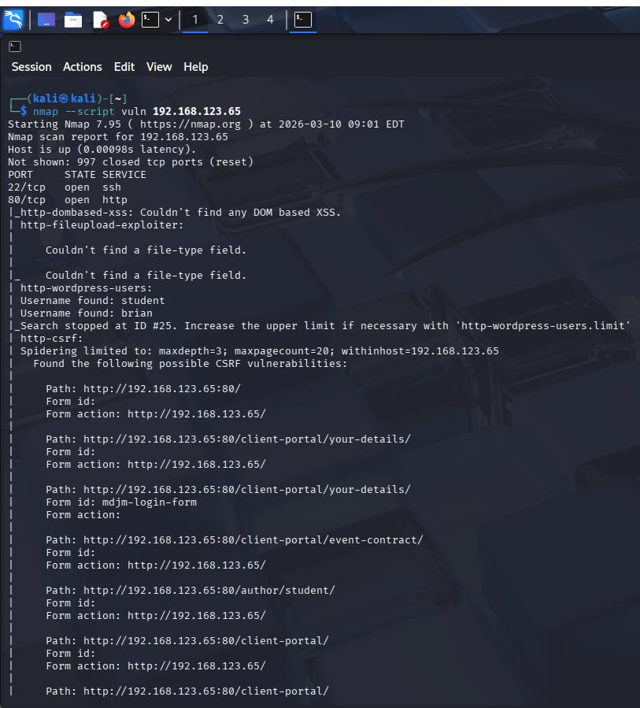

*Figure 99 - Output of vulnerability Script*

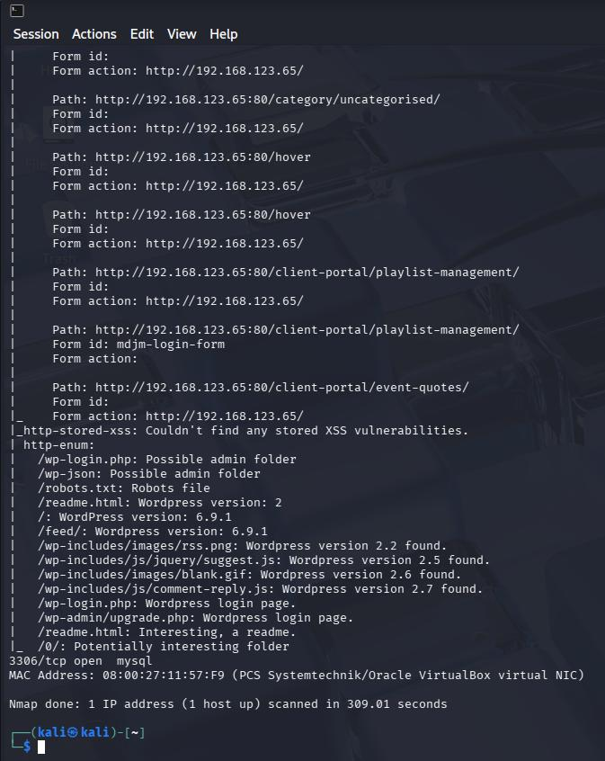

*Figure 100 - Output of vulnerability Script*

2: Specific Script by Name

Runs a http-enum script for listing common web directories, open ports, paths or apps on a http service which is useful if the scanner wants to investigate one service in more detail. To mitigate this, remove unused paths and restrict sensitive resources [19]:

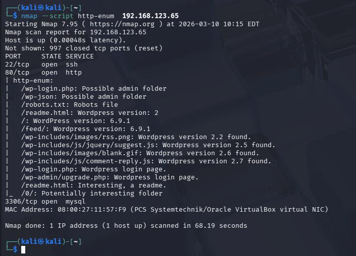

*Figure 101 - Output of specific Script*

3: Combine Version and OS Detection

Combines service detection, OS detection and the default NSE Script to give a more detailed scan that gathers service info and runs common safe scripts for more detail. This makes vulnerabilities easier to find due to software version, OS version and script findings are viewed together. People trying to protect against this should patch exposed services

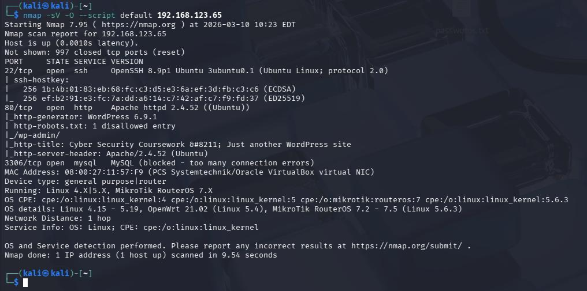

*Figure 102 - Output*

## Section 7: Output Options

1: Save Scan results to text file

Saves the output of scan results to output.txt so it can stored for later use

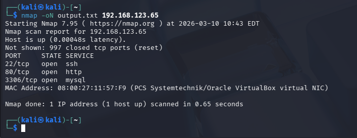

*Figure 103 - Output.txt Output*

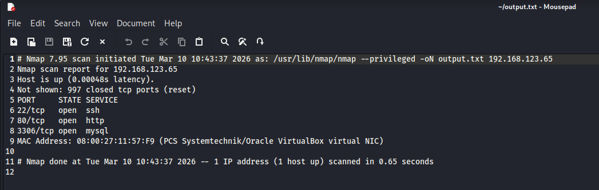

*Figure 104 - Output.txt File*

2: Saves output results as a xml file

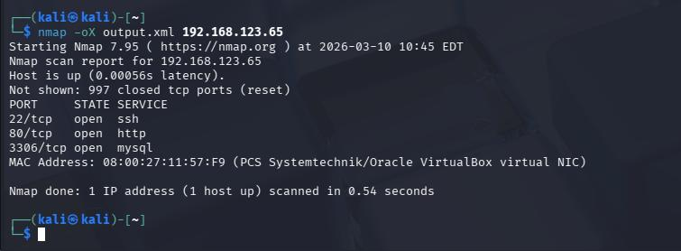

*Figure 105 - Output Results XML FILE*

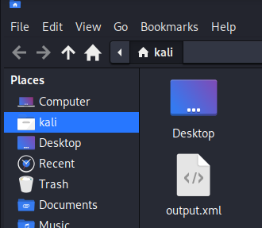

*Figure 106 - Output.xml File*

3: Saves Output in a Greppable Format

Used for quick filtering or scripting

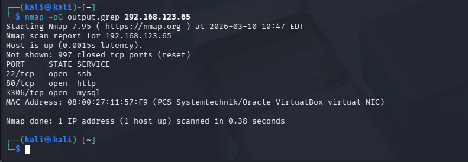

*Figure 107 - Greppable Format Output*

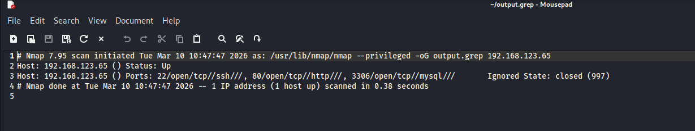

*Figure 108 - Output.grep File*

## Section 8: Advanced Scanning Techniques

1: Avoid Firewall Detection (Decoys)

Decoy scanning adds random spoofed addresses to hide the real source of a scan. The downside to this is that it is not guaranteed that detection systems will be bypassed [20].

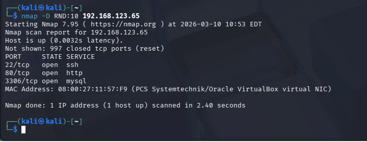

*Figure 109 - Decoys Output*

2: Fragmentation

Used to avoid packet filtering rules by breaking packets into smaller pieces [20]:

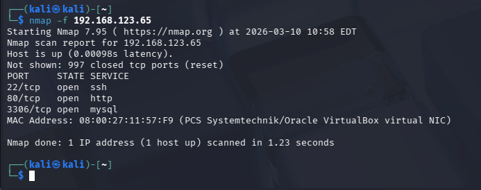

*Figure 110 - Avoid Packet filter*

3: Spoof Mac Address

Used to disguise a scanner’s network identity at the local network layer [20]:

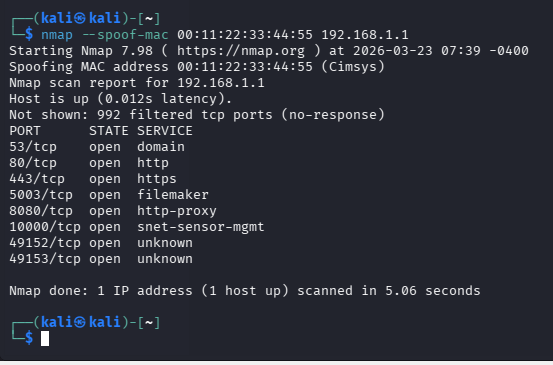

*Figure 111- Spoof Mac Address output*

4: Randomize Host Order

Changes the sequence in which targets are scanned and make scan patterns less predictable. This is useful because sequential scans are easier to find in logs but randomizing the host order spreads the activity across hosts. Based on this information to detect this scan, users should look for scan behaviour over time [21]:

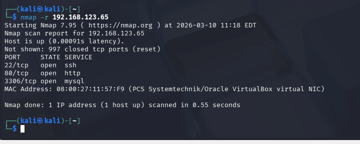

*Figure 112 - Randomize Host order Output*

5: Idle Scan (Stealthy and Spoofed)

Performs a stealthy spoofed scan using a third party zombie host but a limitation of this scan is that it depends on finding a suitable zombie host [22]

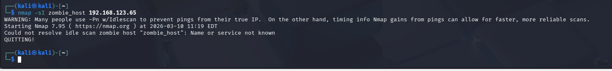

*Figure 119 - Nmap idle scan error output*

6: Timing Options

Controls how fast Nmap sends probes for scanning. Faster timing saves time on reliable networks but it can increase the risk of incorrect results, trigger defenses or produce less reliable results on unreliable networks [14].

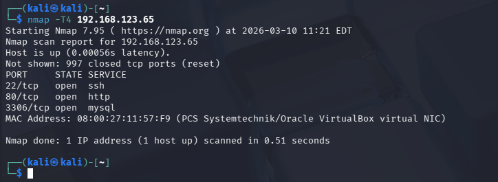

*Figure 113 - Timing Options Output*

## Section 9: Other Useful Commands

1: Trace Route

Performs a Trace Route to the target and is used for seeing the path a packet travels through. This can help attackers deduce the possibility of firewalls or routers being used [14].

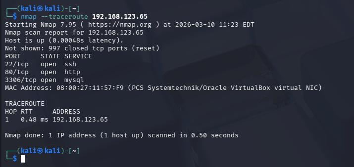

*Figure 114 – Trace Route Output*

2: IPV6 Scanning

Used to check for services reachable over IPv6. Good to use because scanning using Ipv4 address could miss exposed services [14].

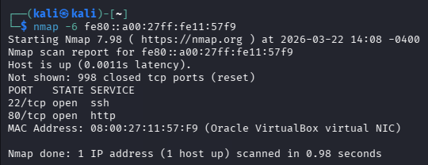

*Figure 115 - Output of ipv6 Scanning*

3: Scan using TCP ACK Packets

Used for mapping firewall rules and determining if ports are filtered instead of finding open ports directly. A limitation is that open ports cannot be identified [15].

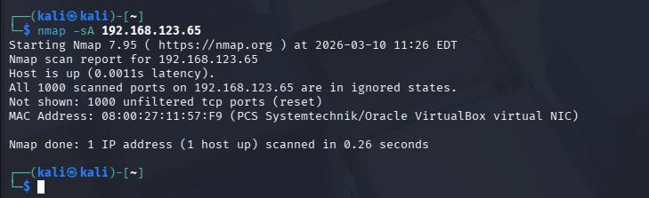

*Figure 116 - TCP ACK Packets*

4: Scan Only hosts with Open ports

Used to find Hosts with open ports that Host Services. This saves time for attackers as systems who host services are more likely to have vulnerabilities [21].

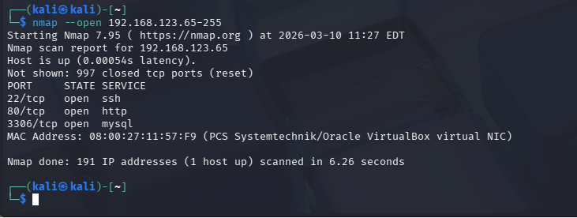

*Figure 117 - Output of hosts with open ports*

---

[← Back to homepage](/)
