[← Back to homepage](/)

Nessus is a scanner used for scanning network vulnerabilities to identify security weaknesses or vulnerabilities before cyberattacks can exploit them. Nessus can find software flaws, missing patches, malware and misconfiguration errors across a wide range of operating systems, devices and applications used in organizations [27]. It also provides configuration, compliance and security audits that enable IT teams to expose previously unknown vulnerabilities that make the business susceptible to cyberattacks and data breaches. Furthermore, Nessus supports multiple vulnerability scoring systems, including CVSS (Common Vulnerability Scoring System) so users can prioritize what vulnerabilities need solving first [27] .

## Installing Nessus

Figure 136 - Nessus installation process shown in the terminal

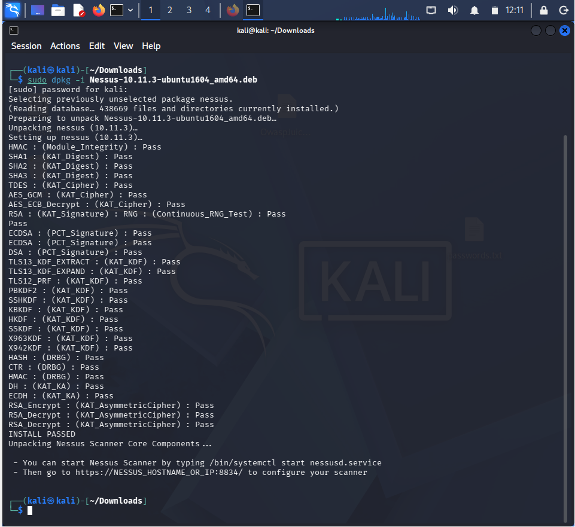

## Nessus initializing:

Figure 137 - Nessus initialization page

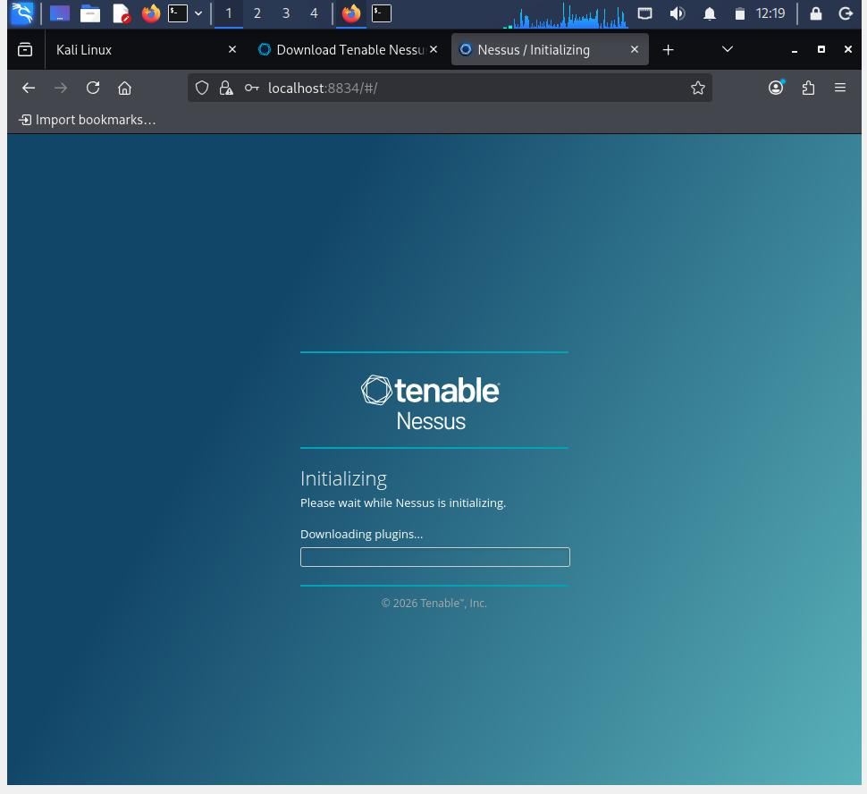

## Wordpress Configuration

Figure 138 - WordPress scan target configuration in Nessus

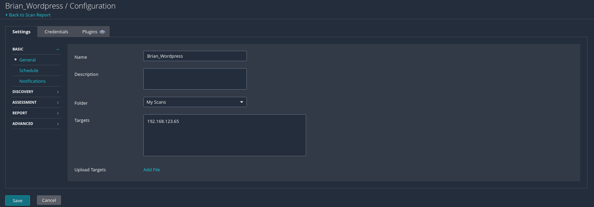

## Scan configuration

Figure 139 - WordPress scan type configuration in Nessus

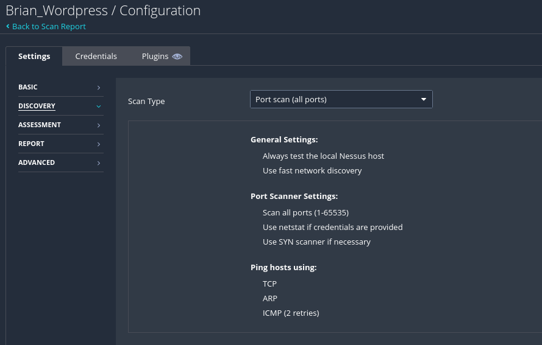

## Scan Type Configuration

Figure 140 - WordPress scan plugin settings in Nessus

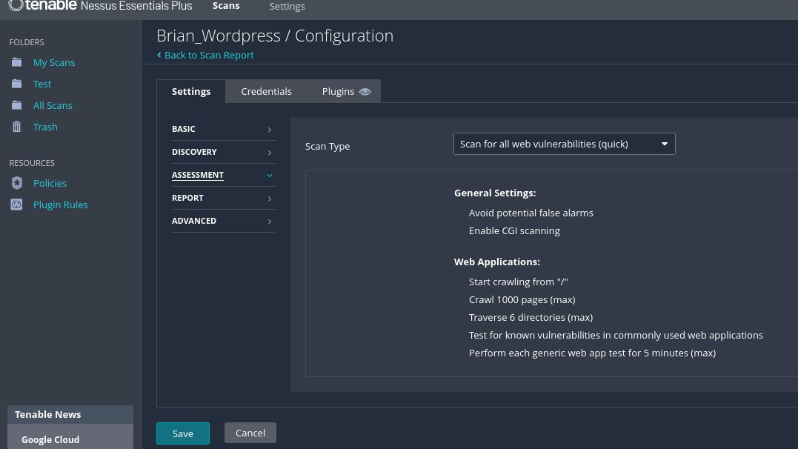

Inputting WordPress credentials so Nessus can access the WordPress server and scan it

Figure 141 - Inserted Wordpress Login details in the credentials section

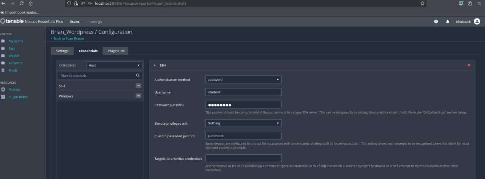

## WordPress Report

A network scan of the WordPress server was conducted using it’s IP address and scanned for all web vulnerabilities and all ports to locate as much vulnerabilities as possible. According to figure 142 and figure 117, 43 critical risk, 189 high risk, 133 medium risk and 17 low risk issues were found on WordPress such as python and OpenSSH vulnerabilities. One of the low-risk issue was a timestamp request data disclosure. The blue information parts are details about the systems configuration and not vulnerabilities. Out of all the vulnerabilities, the critical risk are the ones that needs the most prioritizing due to them having the most potential of causing the most damage but since there are so many, the CVSS score and the effect on the system should  be used to determine which one to prioritize first and based on these 2 factors it would be best to patch the ubuntu and the python vulnerabilities first due to not only having the highest CVSS score but also enabling the execution of remote code.

Below is a table containing details about some of the vulnerabilities found, security implications and some countermeasures which was found by following the plugin links provided in the report.

| Vulnerability | Brief description | Effect on the system | Risk level | Mitigation strategies |
| --- | --- | --- | --- | --- |
| Python vulnerabilities (USN-6891-1) | Multiple Python package flaws on the Ubuntu host. | Enable remote code execution, service compromise and application instability. | Critical | Update Ubuntu security, update Python-related packages, and restart dependent services. |
| klibc vulnerabilities (USN-6736-1) | Vulnerabilities in the low-level boot/init utility library. | Could affect early boot components and allow serious system-level compromise. | Critical | Patch klibc through OS package manager and check updated package versions. |
| libxml2 vulnerabilities (USN-7302-1) | XML parsing flaws in libxml2. | Malicious XML input could trigger crashes, memory corruption, or code execution in apps that use lbxml2. | Critical | Update libxml2, review applications that parse XML, and disable unnecessary XML features. |
| Apache HTTP Server vulnerabilities (USN-5942-1) | Critical Apache flaws on the web server. | Attackers may exploit the web service directly, leading to compromise or denial of service. | Critical | Upgrade Apache, disable unused modules and harden configuration, |
| OpenSSH vulnerabilities (USN-6560-1) | Critical issues in the SSH service used for remote administration. | May allow unauthorized remote access, code execution, or credential compromise. | Critical | Update OpenSSH, restrict SSH exposure by firewall, disable password auth, and enforce SSH keys. |
| LibTIFF vulnerabilities (USN-7783-1) | Image-processing flaws in LibTIFF. | crash services or potentially enable code execution. | High | Update LibTIFF and avoid processing untrusted image files until updated. |
| Sudo vulnerabilities (USN-7604-1) | Weaknesses in sudo, the privilege escalation utility. | A local user could gain elevated privileges or bypass configured restrictions. | High | Patch sudo and limit privileged access to essential admins only. |
| GNU C Library vulnerabilities (USN-8005-1) | Security issues in glibc, a core system library. | Affects many processes across the system and may lead to crashes or exploitation. | High | Apply OS updates promptly and restart critical services or reboot if required. |
| Twisted vulnerability (USN-6988-2) | Vulnerability in the Twisted Python networking framework. | Could affect Python-based network services and expose them to denial of service or abuse. | High | Upgrade Twisted-related packages and verify any Python services using the library. |
| Vim < 9.2.0073 Command Injection | A command injection issue in Vim. | Could lead to unauthorized command execution. | High | Upgrade Vim and avoid opening untrusted files directly on the host. |
| PHP vulnerabilities (USN-6757-1) | Multiple PHP flaws affecting the web stack. | Could expose the WordPress site to code execution, data leakage, or service disruption. | Medium | Update PHP packages, validate plugin/theme compatibility, and restart PHP/Apache services. |
| PAM vulnerability (USN-6588-1) | Weakness in Pluggable Authentication Modules. | May affect authentication handling and local account security. | Medium | Patch PAM packages and review authentication policies on the server. |
| MySQL vulnerabilities (USN-6615-1) | Database-related security issues in MySQL. | Could impact database integrity, availability, or confidentiality. | Medium | Update MySQL and  back up databases before patching |
| WordPress User Enumeration | The site may allow attackers to identify valid WordPress usernames. | Brute-force attacks become easier against admin and user accounts. | Medium | Disable enumeration where possible, use security plugins, enforce MFA, and reduce the amount of login attempts. |
| Web Application Potentially Vulnerable to Clickjacking | Pages may be embeddable in malicious frames. | Users could be tricked into clicking hidden elements, causing unintended actions. | Medium | Add X-Frame-Options or CSP frame-ancestors headers and test framing protections. |
| Open VM Tools vulnerability (USN-6257-1) | Low-severity issue in VM guest tools. | Limited direct impact. | Low | Update Open VM Tools through the package manager. |
| Intel Microcode vulnerability (USN-8068-1) | CPU microcode-related security issue. | Could expose the system to hardware-level or processor-related weaknesses. | Low | Apply vendor microcode and OS updates, then reboot if required. |
| Python vulnerability (USN-7218-1) | Lower-severity Python issue on the system. | Could cause  instability if it remains unpatched. | Low | Update Python packages and remove any Python components that are not in use. |
| OpenSSH vulnerabilities (USN-8090-1) | Lower-severity SSH issues remain present. | weakens the remote administration surface. | Low | Update OpenSSH, restrict access to trusted IPs, and review SSH hardening settings. |
| ICMP Timestamp Request Remote Date Disclosure | The host responds to ICMP timestamp requests and reveals time information. | Helps attackers with reconnaissance and host fingerprinting. | Low | Disable ICMP timestamp responses at the firewall or host level. |

Figure 142 - Tenable Nessus WordPress report cover page

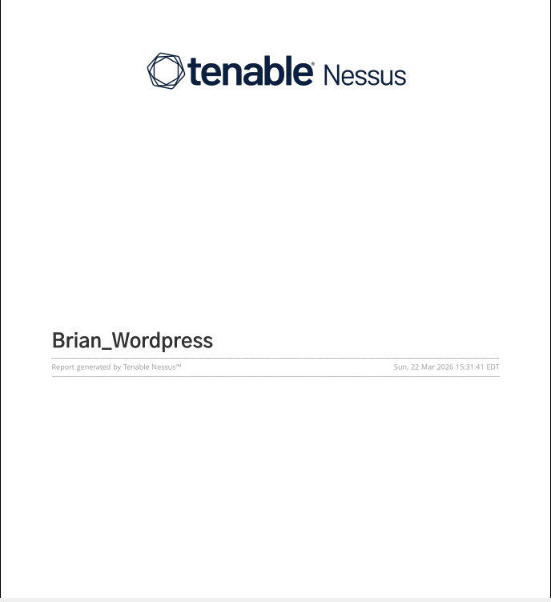

Figure 143 - Nessus WordPress vulnerability summary dashboard

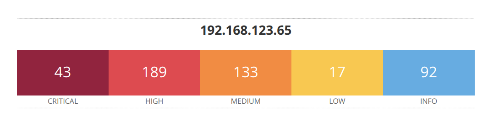

Figure 144 - List of Criticial Risk Vulnerabilities

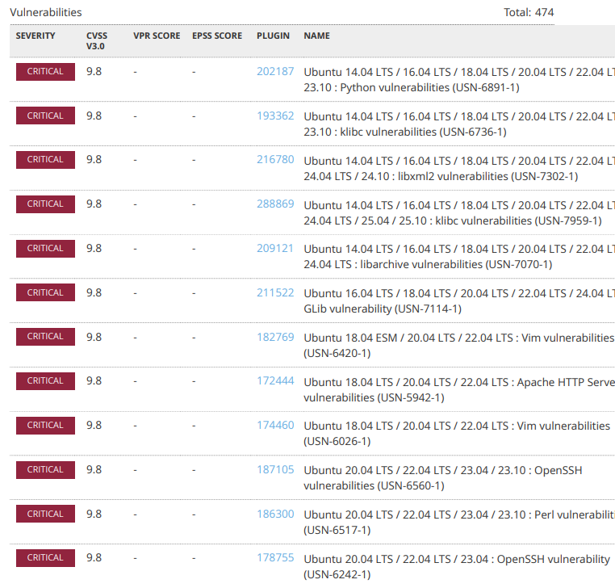

Figure 145 - List of High Risk Vulnerabilities

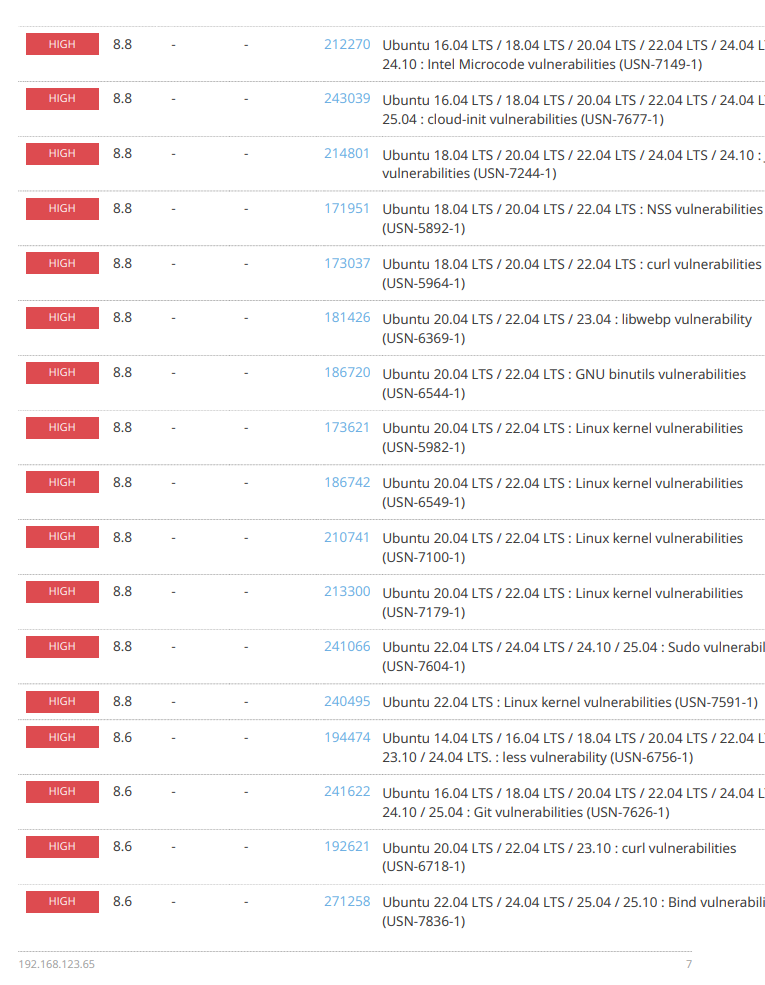

Figure 146 - List of Medium Risk Vulnerabilities

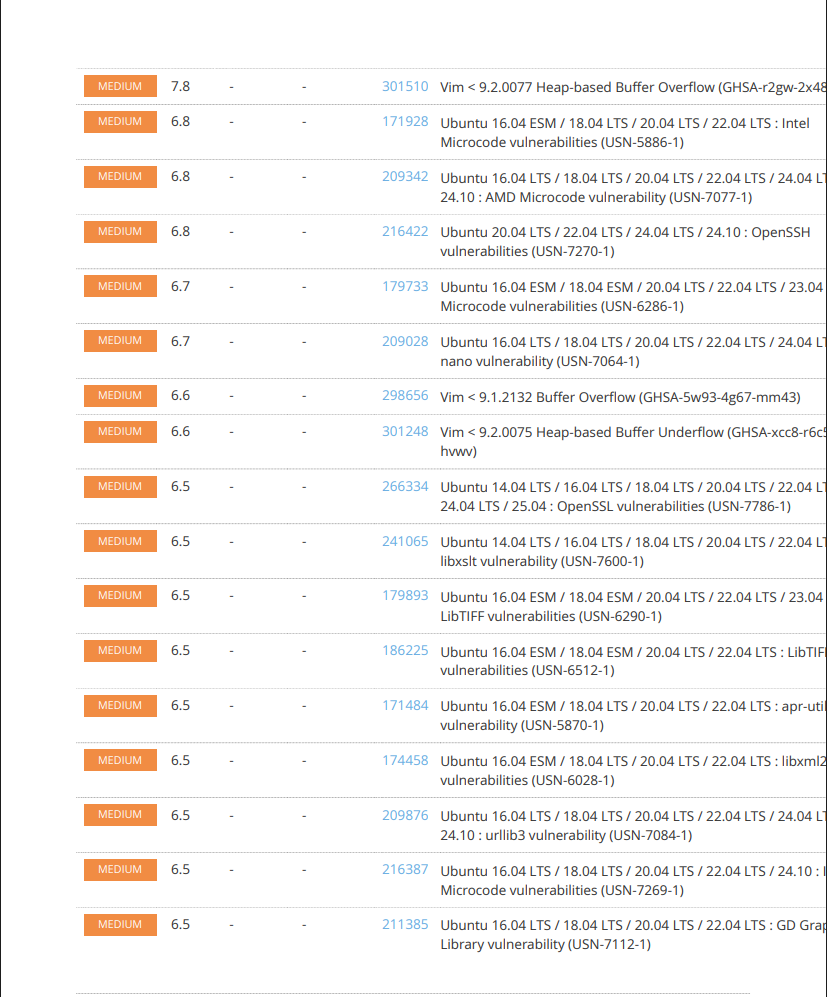

Figure 147 - List of Low Risk Vulnerabilities and 2 Info Attributes

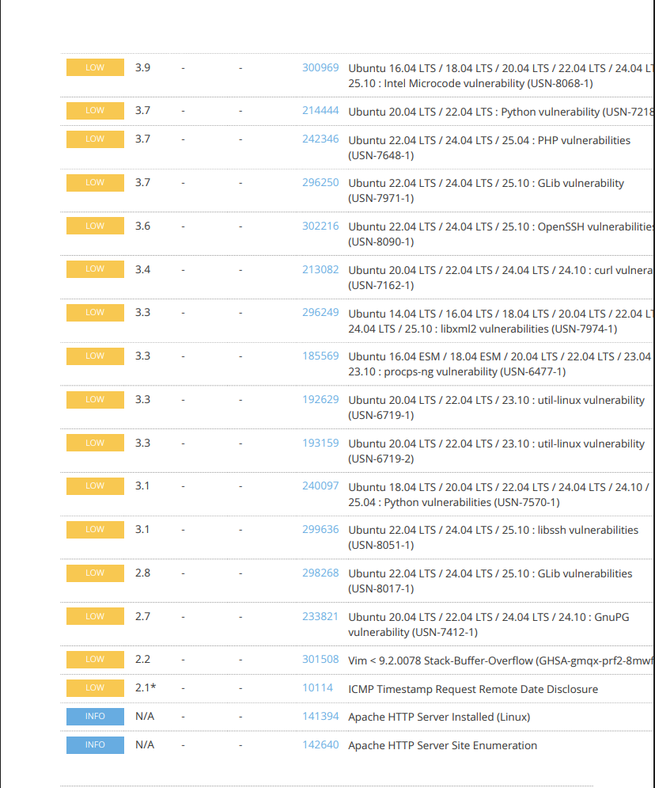

Figure 148- List of Info Attributes

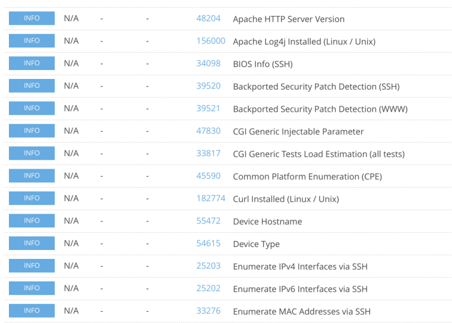

## MSC Gateway Configuration

Figure 148 - MSC Gateway target configuration in Nessus

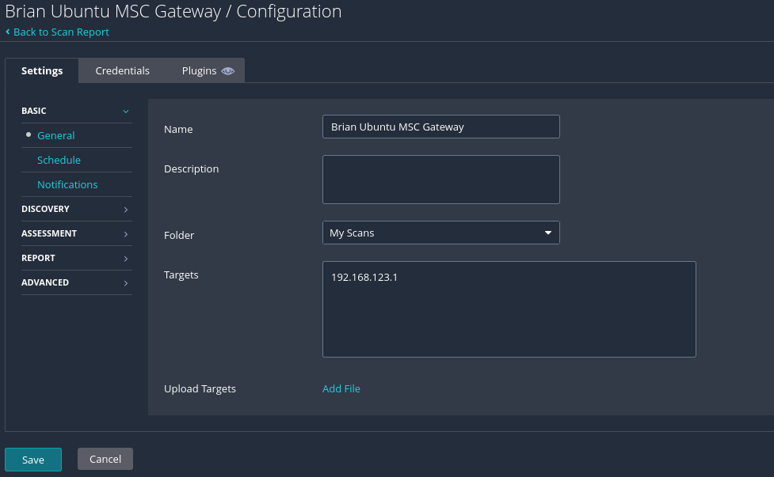

## Ubuntu Gateway Scan Type Configuration

Figure 149 - Ubuntu MSC Gateway scan type configuration in Nessus

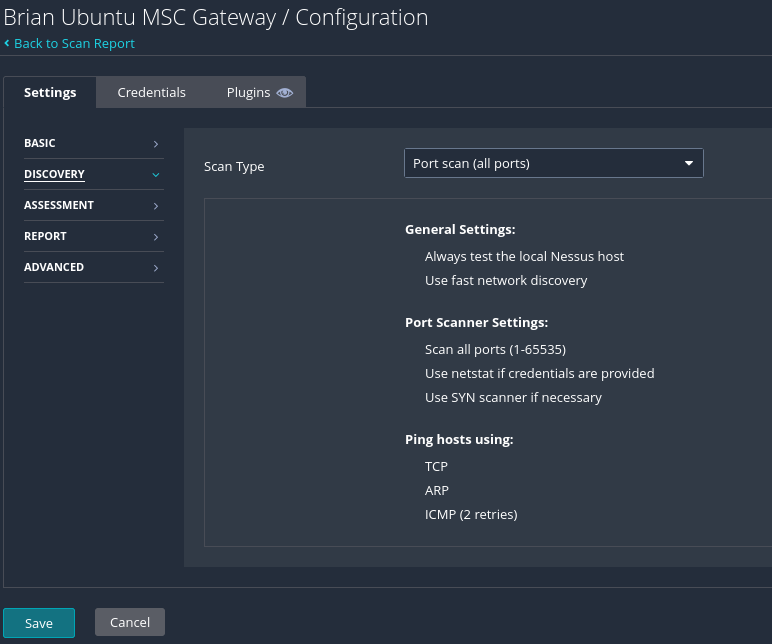

## Ubuntu MSC Gateway Scan type

Figure 150 - Ubuntu MSC Gateway plugin settings in Nessus

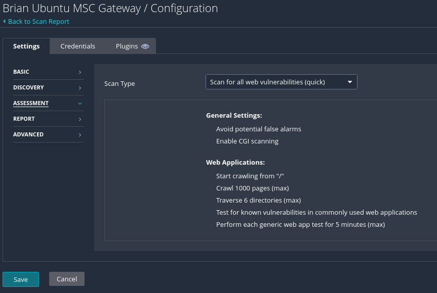

## Inputting MSC Gateway credentials so Nessus can access the MSC Gateway and scan it

Figure 151 - Inserted the MSC Gateway Login Details in the Credentials section

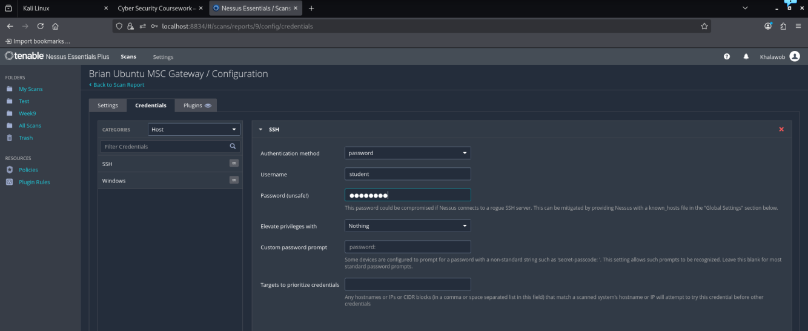

## MSC Gateway report

A network scan of the Gateway server was conducted using it’s IP address and scanned for all web vulnerabilities and all ports to locate as much vulnerabilities as possible. The MSC Gateway report only located 1 high risk vulnerability, 5 medium risk vulnerabilities and 2 low risk vulnerabilities. Based on the report there are not any critical vulnerabilities but the vulnerability that needs to be prioritized should the VIM command injection due to it having the highest risk level and CVSS score.

Below is a table containing some information about the vulnerability and security implications it could have which was found by following the plugin links provided in the generated Nessus report.

| Vulnerability | Brief description | Effect on the system | Risk level | Mitigation strategies |
| --- | --- | --- | --- | --- |
| Vim < 9.2.0073 Command Injection (GHSA-m3xh-9434-g336) | A security flaw  allows command execution through dangreous editing actions. | Execution of unauthorized commands, leading to system compromise or privilege abuse. | High | Upgrade Vim to latest, and limit the users who can edit untrusted files. |
| Vim < 9.2.0077 Heap-based Buffer Overflow | Memory handling flaw in Vim that can corrupt heap memory. | May cause crashes, denial of service or possibly code execution | Medium | Update Vim and remove unused packages, |
| Vim < 9.1.2132 Buffer Overflow | buffer overflow issue in Vim caused by improper bounds checking. | Open a path for arbitrary code execution if exploited. | Medium | Update Vim and reduce exposure to untrusted content. |
| Vim < 9.2.0075 Heap-based Buffer Underflow | Improper memory access before the start of a buffer in Vim. | May trigger crashes or unpredictable behavior | Medium | Update Vim, validate packages installed on the host and enforce change control for local software. |
| ICMP Timestamp Request Remote Date Disclosure | The host responds to ICMP timestamp requests and reveals system time information. | Helps attackers fingerprint the target and find good timing for reconnaissance. | Low | Disable ICMP timestamp responses on thefirewall |
| Vim < 9.2.0078 Stack-Buffer-Overflow | Stack memory corruption issue in Vim. | application crashes and limited exploitation opportunities. | Low | Patch Vim to latest  version |

Figure 152  - MSC Gateway Report Cover Page

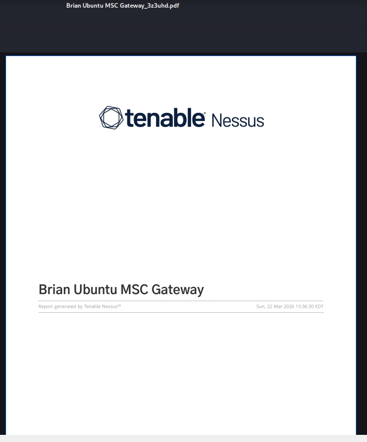

Figure 153 - Nessus MSC Gateway vulnerability summary dashboard

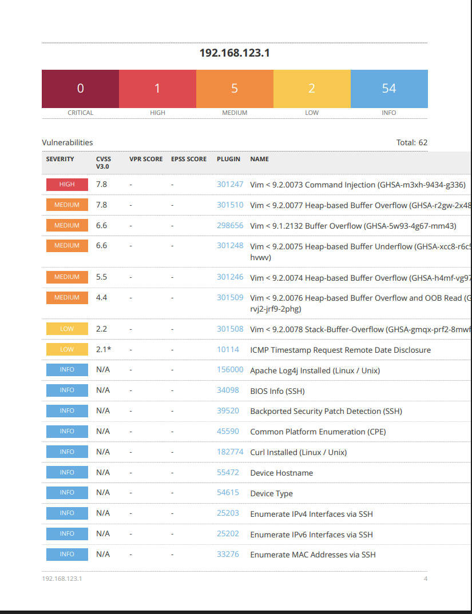

## Analysis and Comparison of both reports

As a reminder, the WordPress server had 43 critical risk, 189 high risk, 133 medium risk and 17 low risk issues while the MSC gateway located 1 high risk vulnerability, 5 medium risk vulnerabilities and 2 low risks. If the 2 reports are compared with each other, it seems as if the MSC Gateway is more secure, but this is because the MSC Gateway hasn’t been modified as much as the WordPress server because the WordPress Server has SSH Enabled and the fact that vulnerable plugins and themes have been purposely installed on WordPress. If the plugins and themes are updated, then it’s likely that the amount of WordPress vulnerabilities will be patched and will be able to gain a fairer evaluation.

Based on the comparison between both reports, It would be best to prioritize fixing the WordPress Server first due to it having much more high risk and critical risk issues affecting Python, Apache, OpenSSH and PHP and can enable the execution of remote code. The MSC Gateway on the other hand is not risk free but has a smaller set of findings focused around Vim-Related Issues.

The bar chart shows that the WordPress server has far more findings in every risk category than the MSC Gateway, especially at the critical and high-risk vulnerabilities. The pie chart shows that while WordPress has many findings overall, not all of them have the same level of urgency, so prioritisation should focus first on the critical and high-severity risk vulnerabilities instead of treating every result equally

Figure 154 - Bar Chart comparing the vulnerability risk findings between two machines

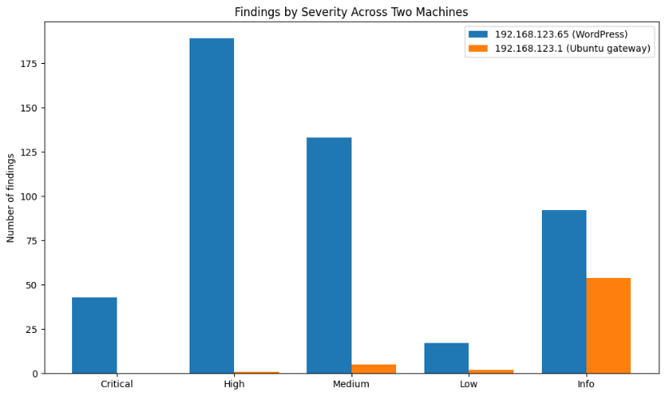

Figure 155 - Pie Chart Showing Wordpress Severity Findings

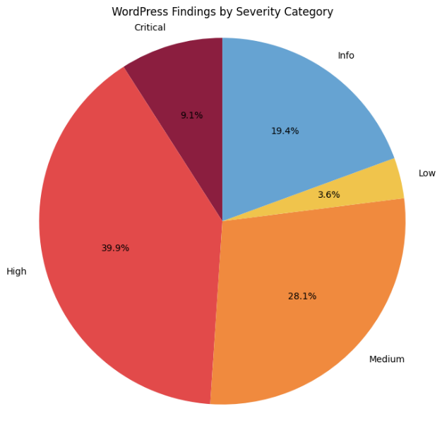

Figure 156 - Pie Chart showing Ubuntu MSC Gateway Severity Findings

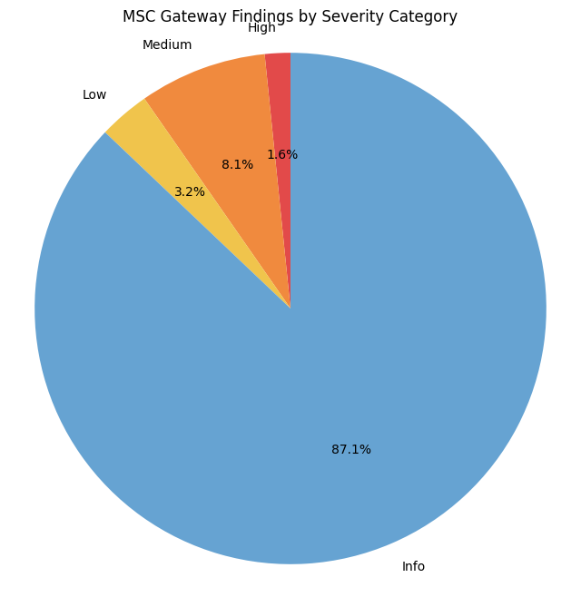

## Reflection

This lab has taught how to use Nessus to identify local and remote vulnerabilities using their network scan and create professional reports that discuss the vulnerabilities and how to locate them. While the scans showed that the WordPress server had a significantly larger number of findings than the MSC Gateway, including critical, high, medium, and low-severity vulnerabilities, it’s important to compare these findings across systems. The gateway seems to be more secure, but this is because there are fewer alerts due to less software running and fewer ports open, which reduces the possibilities of issues. but on the other hand, the WordPress system contains 1 plugin with 26 vulnerabilities on purpose to test vulnerabilities which improves the risk level. This difference is important because, unless the actual context and background of the systems is taken into consideration, the number of risks won't reveal which system is safer.

The most important lesson learnt is that just because a system has a report with less vulnerabilities does not automatically mean a system is secure because the gateways lower amount of vulnerability findings would create a false sense of security if the context about the WordPress server’s intentional modifications was not revealed.

Another important lesson is deciding what vulnerabilities to patch first, Critical and high-risk vulnerability findings on the WordPress server, especially those affecting important services, should be addressed before low risk vulnerabilities. This shows that Nessus is useful not just for identifying vulnerabilities, but for helping decide what to patch first.

## Strengths and Weaknesses

Professional reports can be generated and include CVSS scores and risk level which is essential for prioritizing action based on risk. The plugin architecture means the vulnerability data is constantly being updated and matching findings with the latest information. Nessus does not provide mitigation strategies within the report and must be researched separately on the Nessus website. When setting up Nessus downloading and compiling the plugins can take a very long time and Nessus scans can’t be used until the plugins have finished compiling

---

[← Back to homepage](/)
